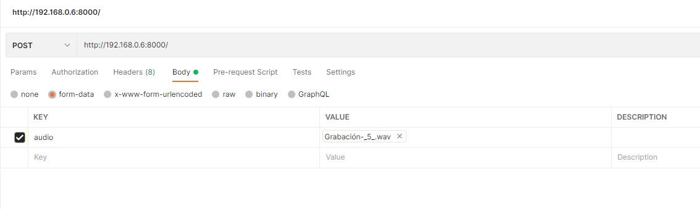

# OCR: Validar Audio

----------

# Getting started

## Requisitos
Instalar docker:

    https://docs.docker.com/get-docker/
## Instalación del contenedor

Clonar  repositorio

    git clone https://github.com/jose-manuel-serna-vera/validacion_de_audio.git

Compilación del contenedor

    docker build -t sjp_tesseract .

Ejecutar el contenedor

    docker run --name sjp_tesseract -d -p 8000:8000 sjp_tesseract:latest

## Ejecución

Llamar a la siguiente URL

# 
